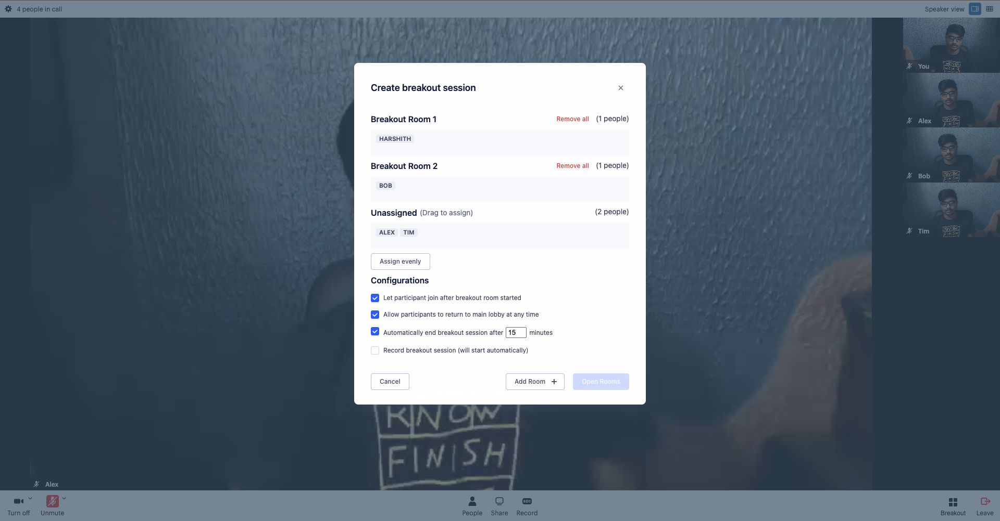
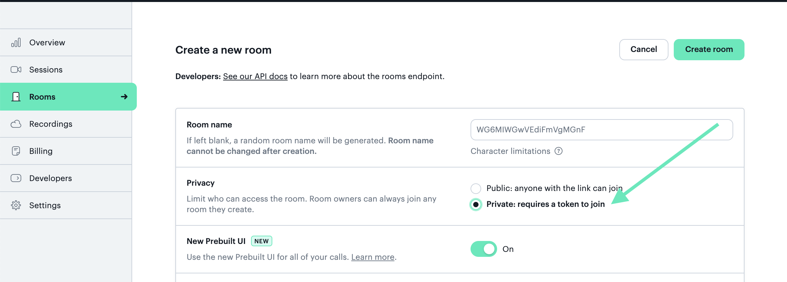

# Daily Breakout Rooms

This demo shows how to use Daily's embeddable video call UI -- [Daily Prebuilt](https://docs.daily.co/guides/products/prebuilt) -- and custom events in a [Next.js](https://nextjs.org/) app to create a breakout room feature. "Breakout rooms" in this context refers to having one main video call where participants can then be split into multiple, smaller video calls.

The breakout room feature is often seen in use cases such as online classrooms where the class format switches between a main lecture and smaller group work sessions.

[Socket.IO](https://socket.io) is used in this demo to handle receiving custom events between participants/rooms.

[TypeScript](https://www.typescriptlang.org/) is also used in this demo.



See below for a more thorough breakdown of app features.

---

## Getting Started

This demo is intended to be used with a `private` Daily [room](https://docs.daily.co/reference/rest-api/rooms/config#privacy). This helps avoid participants joining the room from external links (i.e. not within the breakout room app.)

To create a new private room, use either the Daily [REST API](https://docs.daily.co/reference/rest-api/rooms/create-room) or the [Daily dashboard](https://dashboard.daily.co/rooms/create).



You will need the room information when setting up environment variables below.

1. Installing the dependencies

```bash
yarn install
```

2. Setting up environment variables

```bash
cp .env.example .env.local
```

Now, you can update your variables accordingly in `.env.local` file.

3. Running the development server

```bash
yarn dev
```

Open [http://localhost:3000](http://localhost:3000) with the browser of your choice.

---

## Demo features

1. This demo has two participant types:
   - owners, who can:
     - start/end breakout room sessions
     - configure breakout room settings before and while in the call
     - move participants to different breakout rooms
   - participants, who can:
     - join the main call
     - be moved to breakout rooms

Owners are identified by the `is_owner` value on the Daily [meeting token](https://docs.daily.co/reference/rest-api/meeting-tokens/config#is_owner) used for participants in the call.

2. As mentioned, the Daily room used is private, which means:
   - Rooms cannot be joined externally (i.e. from outside the context of the app) without permission (i.e. a [token](https://docs.daily.co/reference/rest-api/meeting-tokens)).
3. This demo supports several configurations, including
   - The total number of breakout rooms participants can be split into.
   - Auto-joining: if participants should automatically join a breakout room when the breakout session becomes active, or if they can choose when to join.
   - Letting users leave the breakout rooms to return to the lobby room, or making them stay until the breakout session is complete.
   - Breakout room expiration time: when a breakout room expires and all the participants are moved back to the main lobby room.

## Technical implementation

The following custom events are used for managing the breakout rooms, which are dispatched to all call participants:

- `DAILY_BREAKOUT_STARTED`: dispatched when an owner starts the breakout session.
- `DAILY_BREAKOUT_UPDATED`: dispatched when a participant changes their respective room. Additionally, when an owner updates the configuration of the breakout session.
- `DAILY_BREAKOUT_CONCLUDED`: dispatched when an owner of the call ends the breakout session.
- `DAILY_BREAKOUT_REQUEST`: dispatched when a new participant joins the main lobby. To sync with the call, they will need the breakout session object, so this event is used to request it from an existing participant.
- `DAILY_BREAKOUT_SYNC`: dispatched when a participant in the call receives the `DAILY_BREAKOUT_REQUEST` event from a new participant. If they have the breakout session object, they will send the object to everyone in the call in response. This helps keep all participants in the call in sync.

### A note on Socket.IO

We are using [Socket.IO](https://socket.io) to listen to all of these events in the call. If you are familiar with Daily, you may know Daily's [`sendAppMessage` method](https://docs.daily.co/reference/daily-js/instance-methods/send-app-message) is often suggested for sending information between participant calls. However, in this demo, Socket.IO is used instead to accommodate managing multiple Daily rooms at the same time. (`sendAppMessage` will only listen to the events for a single Daily call.)

---

## Learn More

This is a [Next.js](https://nextjs.org/) project bootstrapped with [`create-next-app`](https://github.com/vercel/next.js/tree/canary/packages/create-next-app).

To learn more about Next.js and Typescript, take a look at the following resources:

- [Next.js Documentation](https://nextjs.org/docs) - learn about Next.js features and API.
- [Learn Next.js](https://nextjs.org/learn) - an interactive Next.js tutorial.
- [Typescript Documentation](https://www.typescriptlang.org/docs/) - learn about Typescript.
